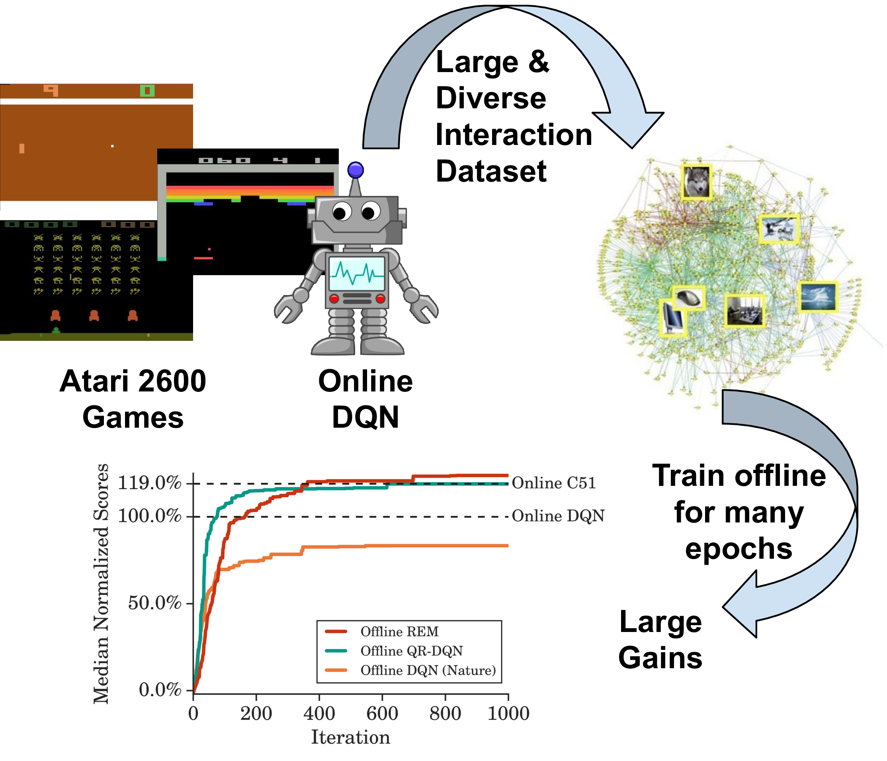

<style>thead { display: none; }</style>

## DQN Replay Dataset 

The DQN Replay dataset dataset was collected as follows:
We first train a [DQN][nature_dqn] agent, on all 60 [Atari 2600 games][ale]
with [sticky actions][stochastic_ale] enabled for 200 million frames (standard protocol) and save all of the experience tuples
of *(observation, action, reward, next observation)* (approximately 50 million)
encountered during training. We repeat this process five times for each game.

This logged DQN data can be found in the public [GCP bucket][gcp_bucket]
`gs://atari-replay-datasets` which can be downloaded using [`gsutil`][gsutil].
To install gsutil, follow the instructions [here][gsutil_install].

After installing gsutil, run the command to copy the entire dataset:

```
gsutil -m cp -R gs://atari-replay-datasets/dqn
```

To run the dataset only for a specific Atari 2600 game (*e.g.*, replace `GAME_NAME`
by `Pong` to download the logged DQN replay datasets for the game of Pong),
run the command:

```
gsutil -m cp -R gs://atari-replay-datasets/dqn/[GAME_NAME]
```

This data can be generated by running the online agents using
[`batch_rl/baselines/train.py`](https://github.com/google-research/batch_rl/blob/master/batch_rl/baselines/train.py) for 200 million frames
(standard protocol). Note that the dataset consists of approximately 50 million
experience tuples due to frame skipping (*i.e.*, repeating a selected action for
`k` consecutive frames) of 4. The stickiness parameter is set to 0.25, *i.e.*,
there is 25% chance at every time step that the environment will execute the
agent's previous action again, instead of the agent's new action.


[nature_dqn]: https://www.nature.com/articles/nature14236?wm=book_wap_0005
[gsutil_install]: https://cloud.google.com/storage/docs/gsutil_install#install
[gsutil]: https://cloud.google.com/storage/docs/gsutil
[stochastic_ale]: https://arxiv.org/abs/1709.06009
[ale]: https://github.com/mgbellemare/Arcade-Learning-Environment
[gcp_bucket]: https://console.cloud.google.com/storage/browser/atari-replay-datasets

## Abstract

Off-policy reinforcement learning (RL) using a fixed offline dataset of logged interactions is an important consideration in real world applications. This paper studies offline RL using the DQN replay dataset comprising the entire replay experience of a DQN agent on 60 Atari 2600 games. We demonstrate that recent off-policy deep RL algorithms, even when trained solely on this replay dataset, outperform the fully trained DQN agent. To enhance generalization in the offline setting, we present Random Ensemble Mixture (REM), a robust Q-learning algorithm that enforces optimal Bellman consistency on random convex combinations of multiple Q-value estimates. Offline REM trained on the DQN replay dataset surpasses strong RL baselines. The results here present an optimistic view that robust RL algorithms trained on sufficiently large and diverse offline datasets can lead to high quality policies. The DQN replay dataset can serve as an offline RL benchmark and is open-sourced.

<p class="cover" align="center">

</p>


## Authors

<div style="text-align: left;">

<div class="person">
  
  <a href="{{ person.url | relative_url }}">{{ person.name }}</a><br>
  <span>{{ person.title | replace: '&', '<br>' }}</span>
  <!--span>({{ person.topics }})</span-->
</div>

</div>

<p style="text-align: left">
For questions, please contact us at:
<a href="mailto:rishabhagarwal@google.com">rishabhagarwal@google.com</a>,
<a href="mailto:mnorouzi@google.com">mnorouzi@google.com</a>.
</p>
