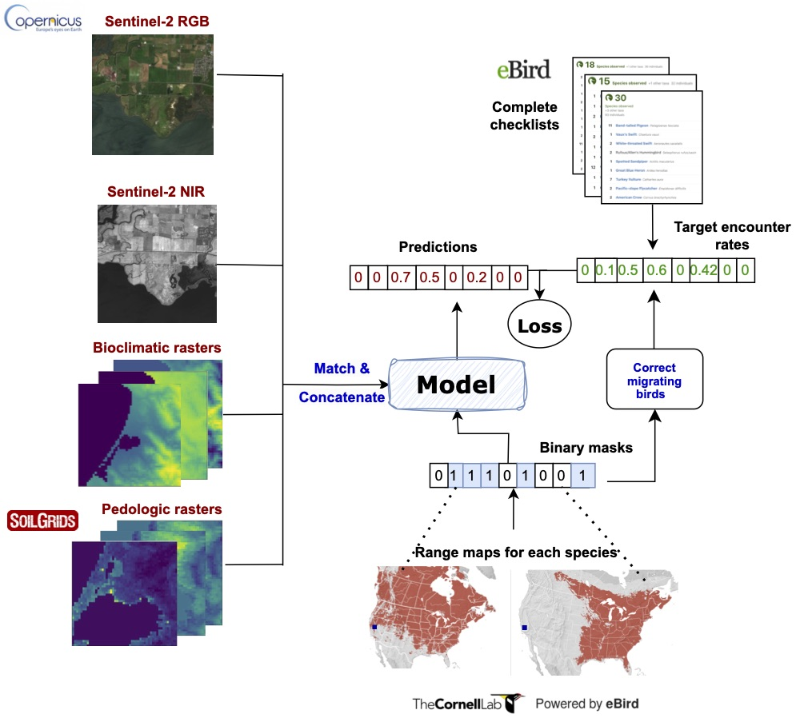

## SatBird Dataset and Benchmark

SatBird is a dataset and benchmark for the task of predicting bird species encounter rates jointly at a specific location using remote sensing data. The dataset was obtained from publicly available [eBird](https://ebird.org/home) bird observation records, Sentinel-2 satellite data, and [WorldClim](https://www.worldclim.org/) and [SoilGrids](https://soilgrids.org/) environmental data. \\
SatBird is composed of 3 sub-datasets: (i) USA summer dataset, generally corresponding to the breeding season, (ii) USA winter dataset, the nonbreeding season, (iii) Kenya dataset, as an example of a low-data regime. 670 and 1054 bird species are considered for the USA and Kenya respectively.

SatBird is designed with the goal of completing species distribution mapping in places that have yet not been surveyed, leveraging the presence-absece nature of complete checklists in the eBird database. 

  
<em align="center" > Overview of data streams for SatBird, as well as inputs and outputs for the task for predicting species encounter rates. Sentinel-2 10m-resolution satellite data can be used along low resolution environmental data as input to a model after matching their resolutions. Labels are derived from eBird complete checklists. Observations of vagrants (migrating birds) in the labels are corrected with range maps from eBird, which can also be incorporated in the model to make it geography-aware.</em>

We also propose a benchmark for this task, comparing models ranging from simple gradient boosted trees regression on environmental variables to transferring vision models pre-trained a large amont of remote sensing images,to CNNs trained from scratch. We found that the best performances were achieved with models using both satellite imagery and environmental information as input.  
SatBird demonstrate the relevance of using both environmental and remote sensing data for species distribution modelling.

## Dataset download and code

The SatBird dataset is available for [download](https://drive.google.com/drive/folders/1eaL2T7U9Imq_CTDSSillETSDJ1vxi5Wq?usp=sharing), and we release the [code](https://github.com/RolnickLab/SatBird/) for building the dataset in other regions of the world and for the benchmark. \\
For more information about the dataset, please refer to the datasheet in the Supplementary Material of the paper. 

Citing
------
If you find this open source release useful, please reference in your paper:

> Teng, M., Elmustafa, A., Akera, B., Radi, H., Bengio, B., Larochelle, H., Rolnick, D.
> SatBird: a Dataset for Bird Species Distribution Modeling using Remote Sensing and Citizen Science Data
> *Conference on Neural Information Processing Systems (NeurIPS) 2023, Datasets and Benchmarks track*.

    @inproceedings{
    }

## Authors



  
  <a href="{{ person.url | relative_url }}">{{ person.name }}</a> 
  {{ person.title | replace: '&', ' ' }}
  <!--span>({{ person.topics }})</span-->



For questions, please contact us at:
<a href="mailto:tengmeli@mila.quebec">tengmeli@mila.quebec</a>,
<a href="mailto:ecosystem-embeddings@mila.quebec">ecosystem-embeddings@mila.quebec</a>.

